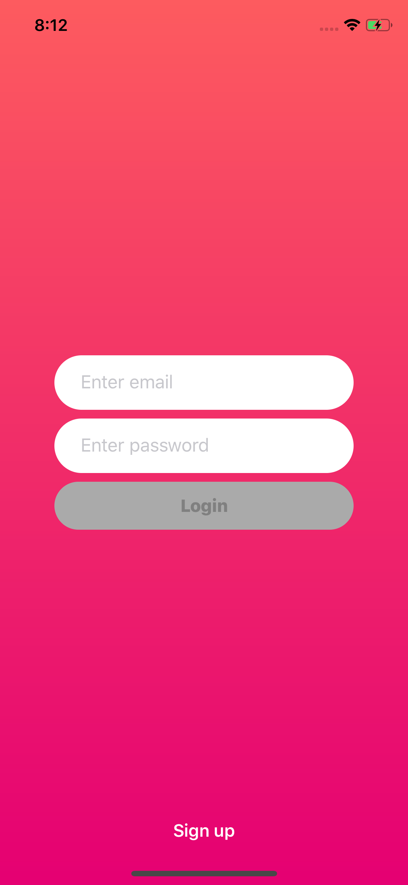
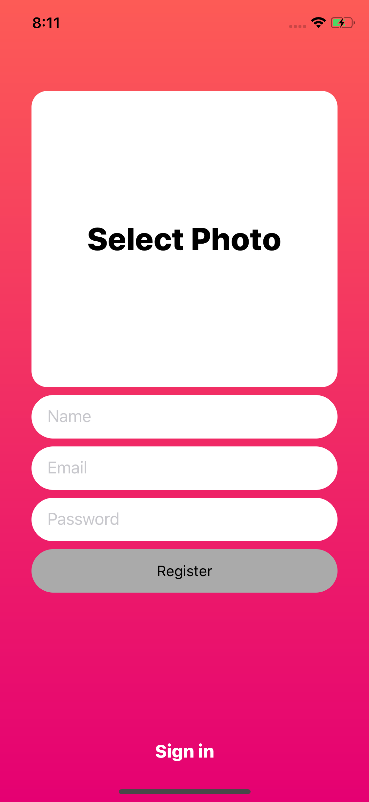
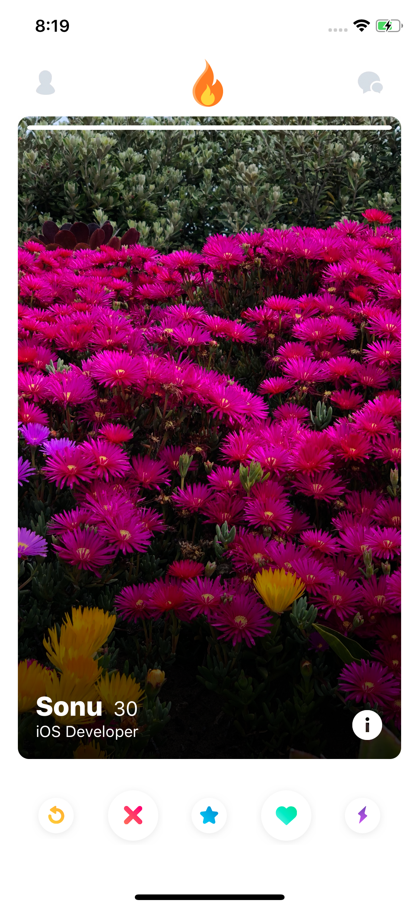
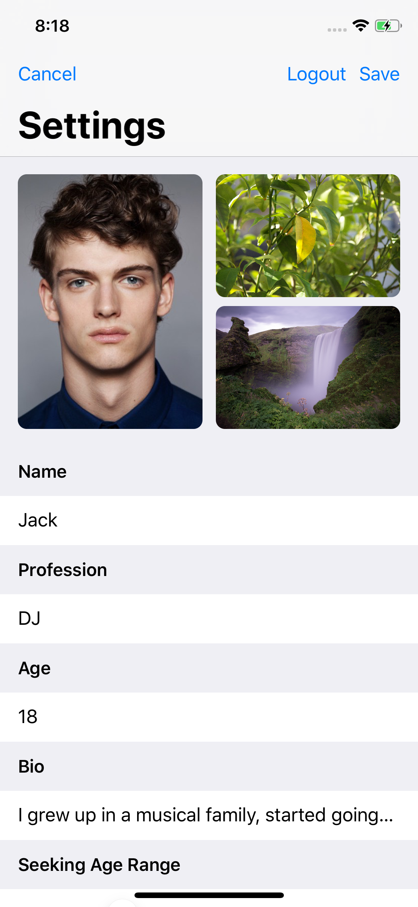
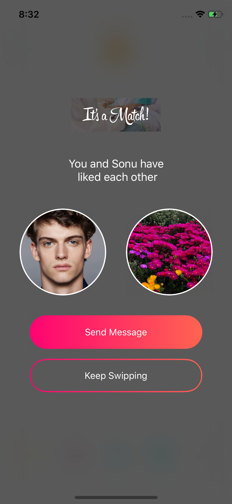

# Tinder-Clone

Match. Chat. Date. Tinder is easy and fun — use the Swipe Right™ feature to like someone, 
use the Swipe Left™ feature to pass. If someone likes you back, 
it’s a match! We invented the double opt-in so that 2 people will only match when there’s a mutual interest. 
No stress. No rejection. Just tap through the profiles you’re interested in, chat online with your matches, 
and then step away from your phone, meet up in the real world and spark something new.

### Login Page

### Registration Page

### Home Page

### User detail Page

### Login user profile Page

### Match Page

### What i learned 
  * Build user interface programatically
  * MVVM Pattern
  * Firebase
  * custom animation
  * Debugging
