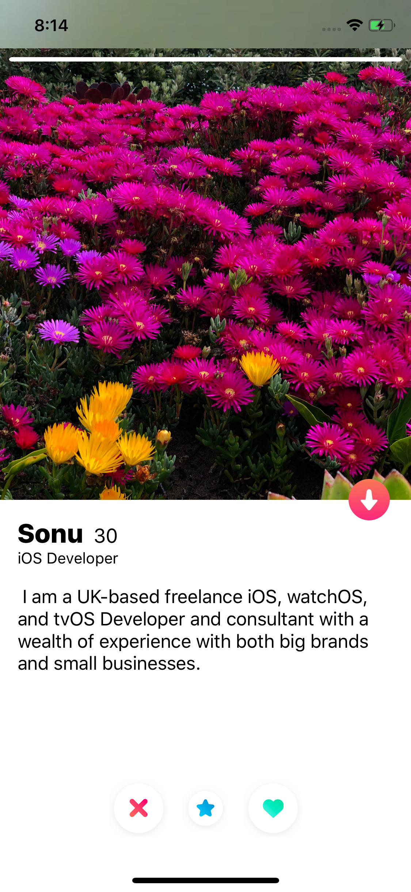

# Tinder-Clone

Tinder Clone App is easy and fun — use the Swipe Right feature to like someone, 
use the Swipe Left feature to pass. If someone likes you back, 
it’s a match!

   - Chat feautre is not supported

### Login Page

### Registration Page

### Home Page

### User detail Page

### Login user profile Page

### Match Page

### What i learned 
  * Build user interface programatically
  * MVVM Pattern
  * Firebase
  * custom animation
  * Debugging
